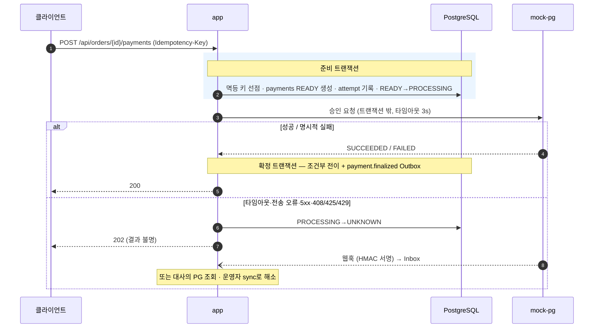
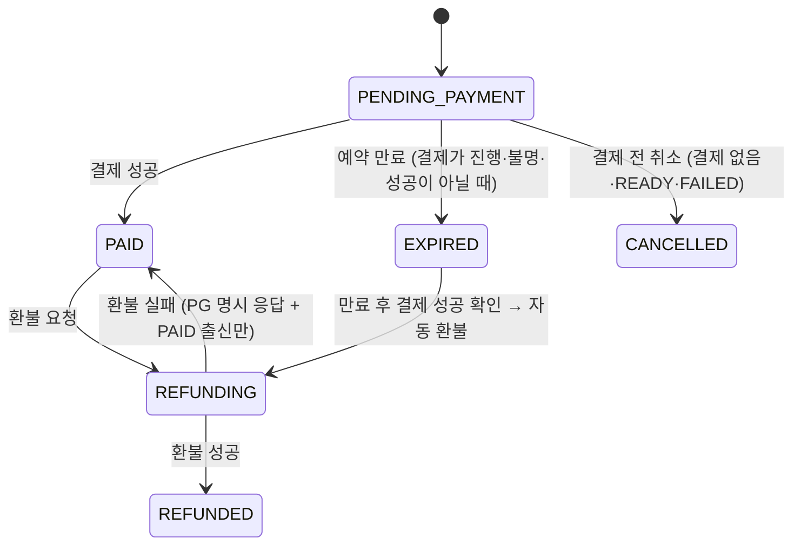
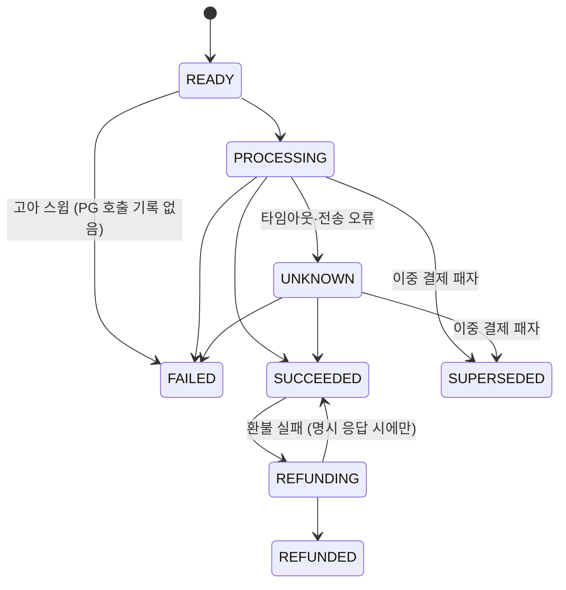

# GroupDrop 설계와 검증

실행 방법은 [README](README.md)에 있다. 이 문서는 핵심 설계, 상태 모델, 검증 시나리오와 결과,
일부러 도입하지 않은 기술을 정리한다.

## 목차

1. [핵심 설계](#1-핵심-설계)
2. [상태 모델](#2-상태-모델)
3. [검증 결과](#3-검증-결과)
4. [도입하지 않은 기술](#4-도입하지-않은-기술)

---

## 1. 핵심 설계

### 1.1 재고: 조건부 원자 UPDATE

재고를 읽고, 계산하고, 저장하는(count-then-insert) 코드는 없다. 판정과 차감을 SQL 한 문장에서 끝낸다
([`OrderRepository.java`](app/src/main/java/com/groupdrop/order/OrderRepository.java)).

```sql
UPDATE campaign_inventories ci
   SET available_quantity = ci.available_quantity - ?,
       reserved_quantity = ci.reserved_quantity + ?
  FROM campaign_skus cs
 WHERE ci.campaign_sku_id = cs.id
   AND cs.campaign_id = ? AND cs.product_sku_id = ?
   AND ci.available_quantity >= ?
RETURNING ci.id AS inventory_id, cs.id AS campaign_sku_id
```

- 영향 행이 0이면 품절(`409 INVENTORY_SOLD_OUT`)이다. 주문에 SKU가 여럿이면 하나라도 실패할 때 트랜잭션 전체를 롤백한다.
- 1인 구매 제한도 같은 방식이다: `UPDATE campaign_user_purchase_counters SET quantity = quantity + ?, … WHERE … AND quantity + ? <= ?`.
- 재고 행은 미리 읽거나 잠그지 않는다. 캠페인 행만 `FOR SHARE`로 잡아 판매 기간·상태를 확인하고, 운영자 강제 종료와 주문이 엇갈리지 않게 한다.
- 재고 불변식 `초기 = 판매 가능 + 예약 + 판매 완료`와 `예약 = ACTIVE 예약 합`을 부하 후 SQL로 검사한다
  ([`inventory-invariants.sql`](load-test/sql/inventory-invariants.sql)).
- 미결제 예약은 10분 뒤 만료되어 재고로 돌아간다. 만료 워커는 `FOR UPDATE SKIP LOCKED`로 후보를 나눠 잡고,
  결제가 `PROCESSING`·`UNKNOWN`·`SUCCEEDED`인 주문은 만료시키지 않는다.

> 다른 방식은 이래서 뺐다. 비관적 락은 조건이 하나뿐이라 잠글 이유가 없다. 낙관적 락은 인기 SKU에서 재시도가
> 오히려 정상 경로가 된다. Redis 재고는 원천을 둘로 만든다.

### 1.2 결제: 트랜잭션 밖 PG 호출과 `UNKNOWN`



- **PG 호출 중에는 DB 트랜잭션도 커넥션도 잡지 않는다.** 준비 → 호출 → 확정을 `TransactionTemplate`으로 명시적으로 나눴다
  ([`PaymentService.java`](app/src/main/java/com/groupdrop/payment/PaymentService.java)).
  요청 스레드가 PG 호출 도중 죽을 수도 있으므로, 1분 주기 **고아 결제 스윕**이 PG 타임아웃의 2배(6초)를 넘긴 결제 중
  PG 호출 기록이 있는 `PROCESSING`은 `UNKNOWN`으로, 호출 기록이 없는 `READY`는 `FAILED`로 정리한다.
- **타임아웃을 실패로 처리하지 않는다.** 실제로는 승인된 결제를 실패로 적으면 재고는 다시 팔리고 고객 청구는 그대로 남는다. 그래서 타임아웃·전송 오류·5xx,
  그리고 PG의 408/425/429 응답은 `UNKNOWN`으로 두고 API는 `202`로 답한다. `UNKNOWN`은 웹훅, 대사(30분 주기)의 PG 조회 단계,
  운영자 `POST /api/admin/payments/{id}/sync` 중 먼저 도착하는 쪽이 해소한다. PG 조회는 사실 같은 `merchantPaymentId`로 승인을
  다시 요청한다(PG가 이 ID 기준으로 멱등이라 가능하다).
- **결제를 확정하는 코드는 한 곳뿐이다.** 동기 응답·웹훅·조회·스윕 어디서 오든 [`PaymentFinalizer`](app/src/main/java/com/groupdrop/payment/PaymentFinalizer.java)의
  조건부 전이만 통과하고, `payment.finalized` Outbox 이벤트도 여기서만 발행한다.
- **멱등 키.** `(scope, idempotency_key)` 유니크로 선점하고 24시간 유지한다. 같은 키 재요청은 저장된 응답을 재생하고, 본문이 다르면
  `409 IDEMPOTENCY_KEY_REUSED`, 처리 중이면 `409 IDEMPOTENCY_REQUEST_IN_PROGRESS`, 만료되었으면 `409 IDEMPOTENCY_KEY_EXPIRED`로 답한다. 요청 스레드가 죽어 `IN_PROGRESS`로 남은 선점은
  레코드를 지우지 않고 결제의 현재 상태로 **완료 처리**한다. 지우면 같은 키가 새 요청으로 취급되어 PG 승인이 한 번 더 나갈 수 있다.
- **한 주문에 유효 결제는 하나.** 진행 중 결제가 있으면 애플리케이션이 `409 PAYMENT_ALREADY_IN_PROGRESS`로 먼저 막는다. 다만 이건 1차 방어이고
  마지막 방어선은 부분 유니크 인덱스다. 경쟁 끝에 두 번째 결제까지 성공하면 그 결제는 `SUPERSEDED`로 보내고 자동으로 보상 환불한다.

  ```sql
  CREATE UNIQUE INDEX ux_payments_order_effective
      ON payments (order_id)
      WHERE status IN ('SUCCEEDED', 'REFUNDING', 'REFUNDED');
  ```

### 1.3 웹훅과 Outbox / Inbox

- 웹훅 서명은 `X-PG-Signature` = `HMAC-SHA256(secret, timestamp + "." + 원본 본문)`, 타임스탬프는 `X-PG-Timestamp`로 받는다.
  역직렬화 전 원문으로 검증하고, 서명이 틀리면 `401 WEBHOOK_SIGNATURE_INVALID`, 타임스탬프가 5분 이상 어긋나면 거부한다.
  검증을 통과하면 Inbox에 넣기만 하고 바로 200을 돌려준다. 처리는 비동기이고, 중복이면 `"result": "DUPLICATE"`로 답한다.
- 중복 방어는 두 겹이다. ① `inbox_events.provider_event_id` 유니크 + `ON CONFLICT DO NOTHING`,
  ② 모든 효과가 조건부 전이라서 재처리해도 한 번만 반영된다. 순서가 뒤바뀐 웹훅은 `occurredAt`을 비교하지 않고 **허용 전이표**로 판정한다.
  허용되지 않는 전이는 실패로 두지 않고 `IGNORED`로 종결한 뒤 감사 로그를 남긴다.
- Outbox·Inbox 워커는 `FOR UPDATE SKIP LOCKED`로 이벤트를 나눠 잡고 `available_at`을 미뤄 리스를 건다.
  실패하면 5초 간격으로 최대 10회 재시도하고, 그래도 안 되면 `FAILED`로 멈춘다. 되살리는 방법은 운영자 재처리 API 하나다.
- Kafka는 쓰지 않았다. Kafka를 붙여도 DB 커밋과 발행을 원자적으로 묶으려면 결국 Outbox가 필요하고, 이벤트도 3종
  (`payment.finalized`, `refund.requested`, `refund.completed`)뿐이다.

### 1.4 환불

요청 스레드는 `refunds` 행과 `refund.requested` Outbox 이벤트를 한 트랜잭션에 커밋하고 `202`로 답한다. PG 환불 호출은
Outbox 워커가 트랜잭션 밖에서 한다. 성공한 결제 하나에 유효 환불은 1건이고, 마지막 방어선은 `refunds(payment_id) WHERE status <> 'FAILED'` 부분 유니크다.
PG 환불 응답이 유실되면 환불은 `REQUESTED`에 머물다가 Outbox 재시도나 대사의 미완 환불 해소 단계에서 확정된다.
MVP는 **운영자가 실행하는 전액 환불**만 지원하고, 캠페인 종료 후 30일이 지나면 `409 REFUND_WINDOW_CLOSED`로 거부한다.

### 1.5 원장: 불변 복식부기

- **불변성은 코드 규율에 맡기지 않고 DB가 강제한다.** `ledger_transactions`·`ledger_entries`에 대한 UPDATE/DELETE는 트리거가 거부한다
  ([`V4__refunds_and_ledger.sql`](app/src/main/resources/db/migration/V4__refunds_and_ledger.sql)).

  ```sql
  CREATE TRIGGER trg_ledger_entries_immutable
      BEFORE UPDATE OR DELETE ON ledger_entries
      FOR EACH ROW EXECUTE FUNCTION ledger_reject_mutation();
  -- 거부 메시지: '원장은 불변입니다 (LED-01). 보정은 반대 거래를 추가하세요: <테이블명>'
  ```

- **환불은 반대 분개로 기록한다.** 금액을 다시 계산하지 않고 원본 결제 분개의 차변·대변만 뒤집는다. 다시 계산하면 그사이 정책이 바뀌었을 때
  결제와 환불 금액이 어긋나고, 그 차이가 잔액으로 계속 남는다.
- **원장 거래 멱등.** `(transaction_type, reference_type, reference_id)`가 유니크라서 이벤트가 다시 전달되어도 분개는 한 번만 생긴다.
- **라운딩은 bp 정수 연산 + 잔여.** 커미션과 PG 수수료는 원 단위에서 절사하고, 남는 금액을 플랫폼 수익으로 잡는다. 이렇게 하면 차변 = 대변이 계산 방식 자체로 보장된다.
  `double`·`BigDecimal`을 쓰지 않는다. 19,900원 · 커미션 7.5% · PG 수수료 3% · 공급 단가 1,000원일 때:

  | 계정 | 금액 | 계산 |
  |---|---:|---|
  | 차변 PG 미수금 | 19,900 | 결제 금액 |
  | 대변 공급사 지급 예정금 | 1,000 | 공급 단가 × 수량 |
  | 대변 인플루언서 지급 예정금 | 1,492 | `floor(19,900 × 750 / 10,000)` — 1,492.5에서 절사 |
  | 대변 PG 수수료 예정금 | 597 | `floor(19,900 × 300 / 10,000)` |
  | 대변 플랫폼 수익 | 16,811 | 잔여 |

  테스트 픽스처는 일부러 19,900 × 7.5%처럼 나누어떨어지지 않는 값을 쓴다. 딱 떨어지는 값만 쓰면 라운딩 결함이 있어도 테스트는 통과한다.
- **정산 금액은 원장에서만 나온다.** 예상 정산액과 정산 배치 모두 "주문별 원장 금액의 합"을 읽는다. 별도 집계식은 검증용 불변식으로만 쓴다.
- 주문은 캠페인의 현재 정책이 아니라 **정책 버전**을 FK로 참조하고 분개도 그 버전에서 읽는다. MVP에는 판매 시작 후 정책을 바꾸는
  경로가 없어 버전은 1개뿐이다. 그래도 나중에 변경 경로가 생겼을 때 이미 받은 주문의 분개가 소급해서 바뀌지 않도록 미리 이렇게 해 두었다.

### 1.6 정산과 대사

- **정산 흐름.** 캠페인이 `CLOSED`된 뒤 유예 기간(기본 7일)이 지나고, 그 캠페인의 미처리 확정 이벤트와 미확정 결제가 0건이면
  `SETTLING`으로 동결한다. 수령 주체(공급사·인플루언서)별 배치를 만들어 검증 → 가상 지급하고, 모든 배치가 `COMPLETED`면
  캠페인은 `SETTLED`가 된다. 전액 환불되어 정산할 것이 없는 캠페인은 배치 없이 바로 `SETTLED`로 끝난다.
- **이중 정산 방지 (S6).** `settlement_items`에 `UNIQUE (payee_type, order_item_id)`와 복합 FK `(batch_id, payee_type)`를 둬서,
  한 주문 항목이 공급사 배치와 인플루언서 배치에 각각 정확히 한 번씩만 들어간다.
- **동결 스냅숏 경쟁 방지.** 결제 준비·결제 확정·환불 확정·정산 동결은 모두 캠페인 행부터 `SELECT … FOR UPDATE`로 잠근다
  ([`CampaignTransactionBarrier`](app/src/main/java/com/groupdrop/common/CampaignTransactionBarrier.java)).
  READ COMMITTED에서는 "미확정 결제 0건"과 "주문 목록"을 따로 읽는 사이에 결제가 확정되면 그 결제가 정산에서 빠질 수 있는데, 이 잠금이 그걸 막는다.
  PG를 호출하는 동안에는 잡지 않는다.
- **정산 후 환불 (S8).** 정산 배치에 포함된(정산 항목이 있는) 주문이 환불되면, 배치의 지급 여부와 무관하게 음수 금액의 `RECOVERY` 배치를 즉시 만들어 상계한다.
  `settlement_adjustments (settlement_item_id, refund_id)` 유니크로 재전달에도 한 번만 생긴다.
- **대사 (S4-b·S7).** 3단계로 진행한다. ① 비최종 결제를 PG 조회로 해소 → ② PG 거래와 내부 결제를 매칭해 불일치 분류 → ③ 원장 전수 재검산.
  불일치는 8개 유형이다: `MISSING_INTERNAL`, `MISSING_PROVIDER`, `AMOUNT_MISMATCH`, `STATUS_MISMATCH`, `REFUND_MISMATCH`,
  `OCCURRED_AT_MISMATCH`(발생 시각 1초 초과 차이), `DUPLICATE_PAYMENT`, `UNRESOLVED_INTERNAL`.
  미해결 불일치가 있는 캠페인의 정산은 `HELD`로 보류한다.
- **대사는 한 번에 하나만.** `reconciliation_runs ((1)) WHERE status = 'RUNNING'` 부분 유니크로 동시에 하나만 실행되게 한다. 도중에 멈춘 실행은
  stale로 판정해 `FAILED`로 회수하고, 자동 해소는 이번 실행의 cutoff 이전에 발생한 불일치에만 적용한다.

### 1.7 공통 규칙

- **상태 전이는 허용 전이표 + 조건부 `UPDATE … WHERE status = :expected`로만 한다.** 영향 행이 0이면 원인을 구분해서 응답한다.
- **상태 값의 진실 원천은 DB `CHECK` 제약이다.** 주문·결제 상태는 Java enum이 아니라 문자열이고, 허용 값은 Flyway 마이그레이션에 있다.
- **시간은 주입한 `Clock`으로만 읽는다.** `Instant.now()`·`LocalDateTime.now()` 직접 호출은 금지이고, 유예 기간·예약 시간·폴링 주기는
  모두 프로퍼티로 뺐다 ([`application.yml`](app/src/main/resources/application.yml)).
- **도메인·검증·인증 오류는 RFC 9457 `ProblemDetail`에 도메인 오류 `code`를 더한 형식이다.** 요청마다 `X-Request-Id`를 받거나
  새로 만들어 응답 헤더로 돌려주고 MDC(`requestId`)에도 넣는다. 다만 기본 로그 패턴에는 찍히지 않는다.
- **커밋된 Flyway 마이그레이션은 수정하지 않는다.** 스키마 변경은 새 버전 파일로만 한다 (현재 V1~V8).

---

## 2. 상태 모델

모든 상태의 허용 값은 DB `CHECK` 제약으로 고정되어 있다. 아래 다이어그램에 없는 전이는 거부된다.

**주문** (`V2__orders_and_stock_reservations.sql`)



**결제** (`V3__payments_outbox_inbox.sql`)



만료 출신 주문(`EXPIRED → REFUNDING`)의 환불이 실패하면 `PAID`로 돌아가지 않고 `REFUNDING`에 머물며 운영자 보류(`ops_hold`)가 걸린다.

**캠페인**: `DRAFT → REVIEWING → SCHEDULED → OPEN ⇄ SOLD_OUT`, `OPEN/SOLD_OUT → CLOSED`(종료 시각 도달 또는 운영자 강제 종료),
`CLOSED → SETTLING → SETTLED`. 반려 시 `REVIEWING → DRAFT`, 운영자 `/cancel`은 `SCHEDULED`면 `CANCELLED`, `OPEN`·`SOLD_OUT`이면 `CLOSED`로 보낸다.
`SOLD_OUT`은 표시일 뿐 주문 게이트가 아니다.

**정산 배치**: `PENDING → READY → PROCESSING → COMPLETED`. `PENDING/READY/FAILED → HELD`, `HELD → PENDING`, `PROCESSING → FAILED`
(지급 실패, 또는 5분 넘게 멈춘 지급). 재시도는 `FAILED → PENDING`으로 되돌려 지급 전 검증을 다시 통과시킨 뒤 `READY → PROCESSING`으로 간다.

**재고 예약**: `ACTIVE → CONFIRMED | RELEASED | EXPIRED` · **환불**: `REQUESTED → COMPLETED | FAILED`

---

## 3. 검증 결과

검증 시나리오 S1~S8은 구현 전에, 기획 단계에서 성공 조건까지 정해 두었다. `load-test/scripts/release-gate.sh`를 한 번 실행하면
전부 다시 돈다. 게이트는 각 단계의 전체 출력을 [`docs/05-검증-보고서/증거/`](docs/05-검증-보고서/증거/)에
`YYYY-MM-DD-<단계>.txt`로 남긴다.

**최신 게이트 실행: 2026-09-26, 커밋 `54b3dd4`**, 전 단계 PASS

| # | 증명하는 것 | 방법 | 최신 결과 |
|---|---|---|---|
| **S1-a** | 재고 동시성 (단일 인스턴스) | k6 200 VU × 5회 = 1,000건, 재고 100, 1인 구매 제한 10 → 불변식 SQL | 성공 100 / 품절 900 / 5xx 0 / 재고 `available·reserved·sold = 0·100·0` / 위반 0 — `iteration_duration` p50·p95·p99 = 236.71ms · 809.55ms · 1.13s |
| **S1-b** | 재고 동시성 (앱 2대) | 같은 조건을 인스턴스당 500건씩 분산 | app1·app2 각 500건, 성공 100 / 품절 900 / 5xx 0 / 위반 0 — p50·p95·p99 = 331.13ms · 1.09s · 1.42s |
| **S2** | 결제 멱등 | 같은 `Idempotency-Key`로 동시 결제 요청 | 결제 1건, PG 호출 1회 (`PaymentConcurrencyTest`) |
| **S3** | 웹훅 멱등 | 같은 이벤트 ID 웹훅 반복·역순 전송 | Inbox 1건, 주문 전이 1회, 원장 거래 1건 (`PaymentWebhookApiTest`) |
| **S4-a** | `UNKNOWN` → 웹훅 복구 | PG를 "성공 후 타임아웃" 모드로 두고 결제 → 이후 웹훅 수신 (실증에서는 mock-pg가 보류한 웹훅을 재발사) | `SUCCEEDED`·`PAID` 전이 (`PaymentFailureRecoveryTest` + `docker kill` 실증) |
| **S4-b** | `UNKNOWN` → 대사 복구 | 웹훅 없이 대사만 실행 | 대사 직후 `SUCCEEDED`, 다음 폴링에서 `PAID` (`ReconciliationIntegrationTest`) |
| **S5** | 원장 균형 | 결제·환불 혼합 데이터 재검산 | 모든 거래 차변 = 대변, 불균형 거래 0건 (`LedgerIntegrationTest`), 정산 E2E에서 `ledger_unbalanced_total 0` |
| **S6** | 정산 중복 방지 | 정산 완료 후 재실행 | 주문 항목이 수령 주체별 정상 정산 항목에 1번만 포함 (`SettlementFlowIntegrationTest`) |
| **S7** | PG 불일치 대사 | 불일치 거래 주입 (자동 테스트는 스텁 PG, E2E는 mock-pg) | 8개 유형 분류, 발생 시각 1초 허용 경계(1,001ms는 OPEN) (`ReconciliationIntegrationTest`), 미해결 불일치가 있으면 정산 `HELD` (`SettlementFlowIntegrationTest`) |
| **S8** | 정산 후 환불 회수 | 지급 완료 배치에 속한 주문 환불 | 회수(음수) 배치 자동 생성·실행, 지급 예정금 잔액 0 (`SettlementRecoveryIntegrationTest`) |

게이트는 이 밖에도 mock-pg 전체 테스트, 실제 HTTP로 도는
[환불 E2E](docs/05-검증-보고서/증거/2026-09-26-refund-e2e.txt)·[정산·대사 E2E](docs/05-검증-보고서/증거/2026-09-26-settlement-e2e.txt),
[`docker kill` 복구](docs/05-검증-보고서/증거/2026-09-26-compose-kill-recovery.txt)까지 실행한다.

`docker kill` 복구 실증의 순서는 이렇다. 격리된 Compose 스택에 앱 2대를 띄우고, PG가 성공 후 응답을 버리게 만든 다음 `app`을
강제 종료했다가 재기동하고, 보류해 둔 웹훅을 다시 보낸다. 그 결과 `UNKNOWN` 20건 → 결제 `SUCCEEDED` 20 / 주문 `PAID` 20,
Outbox·Inbox 모두 `app` 9건 + `app2` 11건 = 20건 `PROCESSED` (두 인스턴스가 중복 없이 나눠 처리),
`payment-recovery-invariants.sql` 위반 0.

> **수치 읽는 법.** S1의 판정 기준은 "성공 정확히 100·5xx 1% 미만·불변식 위반 0"이고, 이 판정은 증거가 남은
> 게이트 실행 9회(2026-09-03 ~ 09-26, 같은 날 재실행 포함)에서 한 번도 바뀌지 않았다. 지연은 로컬 Docker 단일 호스트에서 잰
> k6 수치라 참고용이다. 기획서는 주문 생성 API p95 500ms를 **잠정 목표**로 두는데, 2026-09-06 실행은 이를 만족했고
> (`iteration_duration` p95: S1-a 455.80ms, S1-b 592.80ms — [부하 테스트 보고서](docs/05-검증-보고서/01-부하-테스트.md))
> 최신 2026-09-26 실행에서는 목표를 넘겼다 (S1-a `http_req_duration` p95 773.37ms).

검증 보고서 모음: [보고서 안내](docs/05-검증-보고서/00-보고서-안내.md) ·
[부하 테스트](docs/05-검증-보고서/01-부하-테스트.md) · [장애 주입](docs/05-검증-보고서/02-장애-주입.md) ·
[최종 회귀](docs/05-검증-보고서/03-최종-회귀.md) · [동시성 경쟁 재현과 해결](docs/05-검증-보고서/04-동시성-재현과-해결.md) ·
[결제 장애 복구](docs/05-검증-보고서/05-결제-장애-복구.md) · [콘솔 시연](docs/05-검증-보고서/06-콘솔-시연.md)

---

## 4. 도입하지 않은 기술

판단 기준은 이것이다. **인프라가 하나 늘면 장애 모드도 하나 는다.** 병목이 측정되기 전까지는 PostgreSQL 하나로 버틴다.

| 기술 | 대신 쓴 것 | 이유 |
|---|---|---|
| Redis (재고 원천·캐시·분산 락) | 조건부 원자 `UPDATE` | 재고 원천이 둘이 되면 이중 쓰기 정합성 문제가 생긴다. DB가 실제 병목으로 측정되기 전에는 도입하지 않는다 |
| Kafka | DB Outbox / Inbox + 폴링 | Kafka를 써도 원자성을 위해 Outbox가 필요하다. 이벤트는 3종뿐이다 |
| 분산 락 | `FOR UPDATE SKIP LOCKED`, 부분 유니크, 조건부 전이 | 락 서버 장애·만료가 새 장애 모드가 된다 |
| 별도 스케줄러 (Quartz 등) | in-process `@Scheduled` + 조건부 전이 | 여러 대에서 중복 실행되어도 전이가 한 번만 성공하도록 만들었다 |
| 마이크로서비스 | 모듈러 모놀리스 (가상 PG만 분리) | 1인·6주 범위에서 분산 트랜잭션 비용을 질 이유가 없다 |
