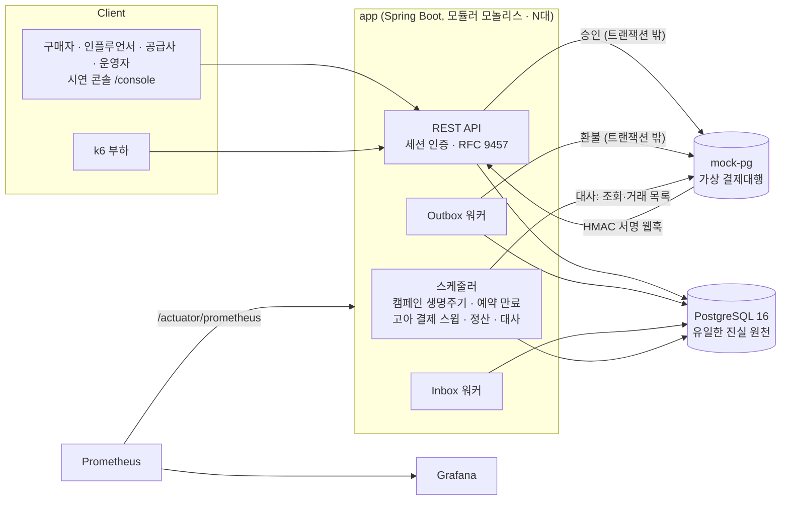

# GroupDrop (CrewDeal)

인플루언서가 여는 한정 시간·한정 수량 공동구매 백엔드다. 캠페인·주문·재고 예약, 외부 PG 결제와 웹훅, 환불,
복식 원장, 공급사·인플루언서 정산, PG 대사를 다룬다. 결제대행은 함께 들어 있는 mock-pg가 흉내 낸다.

`Java 21` · `Spring Boot 4.0.7` · `PostgreSQL 16` · `Flyway` · `DB Outbox/Inbox` · `Testcontainers` · `k6` · `Docker Compose` · `Prometheus/Grafana`

설계 설명과 검증 결과는 [ARCHITECTURE.md](ARCHITECTURE.md)에 따로 정리했다.

## 목차

1. [빠른 시작](#1-빠른-시작)
2. [API 개요](#2-api-개요)
3. [시스템 구성](#3-시스템-구성)
4. [프로젝트 구조](#4-프로젝트-구조)
5. [테스트와 릴리스 게이트](#5-테스트와-릴리스-게이트)
6. [범위와 한계](#6-범위와-한계)
7. [문서](#7-문서)

---

## 1. 빠른 시작

**필요한 것**: Docker (Compose v2). 시드·게이트 스크립트에는 bash·curl·jq, 로컬에서 Gradle로 테스트를 돌리려면 JDK 21.

### 전체 스택

```bash
docker compose up -d --build
```

| 서비스 | 주소 | 비고 |
|---|---|---|
| app | http://localhost:8080 | `/actuator/health`, `/actuator/prometheus` |
| 시연 콘솔 | http://localhost:8080/console/index.html | 4개 역할 화면 + 장애 주입 패널(`/console/demo/`). 운영 API 점검용 단일 화면은 `/admin/index.html` |
| Swagger UI | http://localhost:8080/swagger-ui/index.html | OpenAPI 문서 |
| mock-pg | http://localhost:8081 | 가상 결제대행 |
| PostgreSQL | localhost:5432 | DB·계정 `groupdrop` |
| Prometheus | http://localhost:9090 | 5초 간격 수집 |
| Grafana | http://localhost:3000 | `admin` / `admin`, GroupDrop 대시보드 자동 프로비저닝 |

포트는 `APP_PORT`, `MOCK_PG_PORT`, `POSTGRES_PORT`, `PROMETHEUS_PORT`, `GRAFANA_PORT`(앱 2대 구성에서는 `APP2_PORT`) 환경변수로 바꿀 수 있다.

### 시연 스택 (콘솔로 전 과정 보기)

정산 유예 기간을 0초로 줄인 오버레이와 시드 스크립트를 쓰면 캠페인 개설부터 결제·환불·정산·대사까지 브라우저에서 직접 따라가 볼 수 있다.

```bash
# 항상 볼륨까지 지우고 시작한다 — mock-pg는 인메모리라서 DB 볼륨과 어긋나면 새 결제가 막힌다
docker compose -f docker-compose.yml -f docker-compose.demo.yml down -v
docker compose -f docker-compose.yml -f docker-compose.demo.yml up -d --build
./ops/demo/seed-demo.sh   # 시연 직전에 실행 (생성된 미결제 주문은 10분 뒤 만료)
```

시드 계정 (비밀번호 공통 `groupdrop123!`):

| 역할 | 이메일 |
|---|---|
| 운영자 | `admin@groupdrop.test` |
| 인플루언서 | `influencer@groupdrop.test` |
| 공급사 | `supplier@groupdrop.test` |
| 구매자 | `buyer1@groupdrop.test`, `buyer2@groupdrop.test` |

같은 브라우저에서 두 역할을 동시에 쓰려면 세션 쿠키가 섞이지 않게 한쪽은 `localhost`, 다른 쪽은 `127.0.0.1`로 연다.
시나리오별 조작 순서와 실측 시간은 [콘솔 시연 보고서](docs/05-검증-보고서/06-콘솔-시연.md)에 있다.

> ⚠️ **로컬 시연 전용.** 시드 비밀번호가 고정되어 있고 mock-pg 테스트 제어 API에는 인증이 없다. 외부에 노출하지 말 것.

### 앱 2대로 띄우기

```bash
docker compose -f docker-compose.yml -f docker-compose.two-instances.yml up -d --build
```

`app2`가 58083 포트로 추가된다. 두 인스턴스가 이벤트를 나눠 처리하는 모습이 잘 보이도록 Outbox·Inbox 폴링 주기(1초)와 배치 크기(3)를 줄였고,
예약 유지 시간은 30분, 고아 결제 스윕은 30초로 바꿨다. Prometheus·Grafana는 `observability` 프로필로 분리되어 이 구성에서는 뜨지 않는다.

---

## 2. API 개요

REST 엔드포인트는 56개다. 전체 명세는 앱을 띄운 뒤 Swagger UI(`/swagger-ui/index.html`)에서 볼 수 있다.
주문 생성·결제 요청·환불 요청은 `Idempotency-Key` 헤더가 필수다(결제 전 주문 취소는 상태 조건으로 멱등하다).

| 영역 | 대표 엔드포인트 |
|---|---|
| 인증 | `POST /api/auth/login` · `POST /api/auth/logout` · `GET /api/auth/me` |
| 상품 (공급사) | `POST /api/suppliers/me/products` · `GET /api/products` |
| 캠페인 | `POST /api/campaigns` · `POST /api/campaigns/{id}/submit` · `POST /api/admin/campaigns/{id}/approve·reject·cancel` · `GET /api/campaigns/slug/{slug}` |
| 주문 | `POST /api/campaigns/{campaignId}/orders` (`201`) · `POST /api/orders/{orderId}/cancel` · `GET /api/orders` |
| 결제 | `POST /api/orders/{orderId}/payments` (`200` 확정 / `202` 결과 불명 / `409` 이중 결제 패자) · `POST /api/webhooks/payments` |
| 환불 (운영자) | `POST /api/payments/{paymentId}/refunds` (`202` 접수) |
| 원장·예상 정산 | `GET /api/admin/orders/{orderId}/ledger` · `GET /api/admin/ledger/unbalanced` · `GET /api/influencers/me/campaigns/{id}/dashboard` · `GET /api/suppliers/me/campaigns/{id}/expected-settlement` |
| 정산 (운영자) | `POST /api/admin/settlements` · `POST /api/admin/settlements/{batchId}/retry·hold·release` · `GET /api/influencers/me/settlements` · `GET /api/suppliers/me/settlements` |
| 대사·운영 | `POST /api/admin/reconciliations` · `GET /api/admin/reconciliation-discrepancies` · `POST /api/admin/payments/{paymentId}/sync` · `POST /api/admin/outbox-events/{id}/retry` · `GET /api/admin/ops/summary` |

도메인·검증·인증 오류는 RFC 9457 형식으로 내려간다. 품절일 때의 응답:

```json
{
  "type": "about:blank",
  "title": "Conflict",
  "status": 409,
  "detail": "요청한 SKU의 재고가 부족합니다.",
  "instance": "/api/campaigns/1/orders",
  "code": "INVENTORY_SOLD_OUT"
}
```

---

## 3. 시스템 구성



- **배포 단위는 하나, 인스턴스는 여러 대.** 워커와 스케줄러는 전부 in-process `@Scheduled`다. 분산 락은 없다.
  조건부 `UPDATE`·`FOR UPDATE SKIP LOCKED`·부분 유니크 인덱스만으로 두 대 이상이 동시에 돌아도 안전하다 (S1-b, `docker kill` 실증).
- **mock-pg**는 별도 Spring Boot 앱이다. 승인·환불·조회·대사용 거래 목록 API와, 장애 모드(`DECLINE`·`DELAY`·
  `SUCCEED_BUT_TIMEOUT` 등)·웹훅 재발사·불일치 거래 주입 같은 테스트 제어 API를 제공한다. `merchantPaymentId` 기준으로 멱등이다.
- **도메인 패키지** (`app/src/main/java/com/groupdrop/`):

| 패키지 | 책임 |
|---|---|
| `user` | 세션 로그인, 4개 역할(BUYER·INFLUENCER·SUPPLIER·ADMIN), 시드 계정 |
| `product` | 공급사 상품·SKU 등록 |
| `campaign` | 캠페인 생명주기(승인·자동 시작/종료·품절 표시·강제 종료), 정책 버전 |
| `order` | 주문, 재고 예약·만료, 구매 제한, 결제 전 취소 |
| `payment` | 결제 승인, 멱등성, `UNKNOWN` 처리, 웹훅 수신·서명 검증, 고아 결제 스윕 |
| `outbox` | Transactional Outbox / Inbox 인프라 (도메인 비의존) |
| `refund` | 전체 환불 접수·실행 워커, 이중 결제 보상 환불 |
| `ledger` | 불변 복식 원장, 균형 검증, 예상 정산액 |
| `settlement` | 정산 배치·지급, 정산 후 환불 회수 배치 |
| `reconciliation` | PG 대사, 운영자 재처리 |
| `common` | `Clock` 주입, RFC 9457 오류 포맷, 요청 ID, 캠페인 트랜잭션 장벽, 감사 로그 |

---

## 4. 프로젝트 구조

```
.
├── app/                     메인 백엔드 (Spring Boot, 모듈러 모놀리스)
│   └── src/main/
│       ├── java/com/groupdrop/   도메인 패키지 11개 (3장 표 참고)
│       └── resources/
│           ├── db/migration/     Flyway V1~V8
│           └── static/console/   역할별 시연 콘솔 (정적 HTML/JS)
├── mock-pg/                 가상 결제대행 (장애 모드·웹훅 서명·대사 거래 목록)
├── load-test/
│   ├── k6/                  S1-a·S1-b 부하 스크립트
│   ├── sql/                 불변식 판정 SQL
│   └── scripts/             release-gate.sh 및 단계별 실행 스크립트
├── ops/
│   ├── prometheus/          수집 설정
│   ├── grafana/             데이터소스·대시보드 프로비저닝
│   └── demo/                seed-demo.sh
├── docs/05-검증-보고서/      검증 보고서와 실행 증거 로그
├── docker-compose.yml                  기본 스택
├── docker-compose.demo.yml             시연 오버레이 (정산 유예 0초)
└── docker-compose.two-instances.yml    앱 2대 오버레이
```

---

## 5. 테스트와 릴리스 게이트

S1~S8은 검증 시나리오 번호다. 시나리오별 성공 조건과 최신 결과는 [ARCHITECTURE.md 3장](ARCHITECTURE.md#3-검증-결과)에 있다.

### 자동 테스트

```bash
(cd app && ./gradlew cleanTest test)       # Testcontainers PostgreSQL — Docker 실행 필요
(cd mock-pg && ./gradlew cleanTest test)
```

- H2를 쓰지 않는다. **실제 PostgreSQL**(Testcontainers)에서 제약·트리거·잠금을 그대로 검증한다.
- 테스트 메서드는 app `@Test` 184개 + `@RepeatedTest(5)` 3개, mock-pg `@Test` 38개다(소스 기준 집계).
  2026-09-06 최종 회귀 보고서 시점에는 app 164 / mock-pg 24 tests, 실패·오류·스킵 0이었다.
- 동시성은 두 계층으로 검증한다. ① 단일 JVM 스레드 동시성: `ExecutorService` + `CountDownLatch`/`CyclicBarrier` + Testcontainers로
  멱등 키 동시 요청·결제와 만료의 경쟁·구매 제한을 매 실행 검사한다. ② 다중 인스턴스: 앱 2대 + 공유 DB + k6 부하 후 불변식 SQL로
  재고 초과 판매·Outbox 중복 소비를 검사한다. 단일 JVM 테스트는 커넥션 풀과 인메모리 상태를 공유하기 때문에 다중 인스턴스에서도
  안전하다는 증명이 되지 못한다. ②를 따로 돌리는 이유다.
- 대표 테스트: `PaymentConcurrencyTest`(S2), `PaymentWebhookApiTest`(S3), `PaymentFailureRecoveryTest`(S4-a),
  `ReconciliationIntegrationTest`(S4-b·S7), `LedgerIntegrationTest`(S5·원장 불변 트리거), `SettlementFlowIntegrationTest`(S6·동결 경쟁),
  `SettlementRecoveryIntegrationTest`(S8).

### 릴리스 게이트

```bash
cd load-test && ./scripts/release-gate.sh
```

S1-a → S1-b → S2 … S8 → mock-pg 테스트 → 환불 E2E → 정산·대사 E2E → `docker kill` 복구 순으로 실행한다. 하나라도 실패하면 그 자리에서 멈춘다.

- 추적 중인 소스에 커밋하지 않은 변경이 있으면 실행하지 않는다(증거 디렉터리와 미추적 파일은 판정에서 뺀다). `ALLOW_DIRTY=1`로
  우회하면 증거 파일의 `source_commit`에 `-dirty`가 붙는다.
- 단계마다 격리된 Compose 프로젝트와 전용 포트를 쓰기 때문에 로컬 개발 스택과 부딪히지 않는다.
- 각 단계의 전체 출력이 `docs/05-검증-보고서/증거/<날짜>-<단계>.txt`에 기록된다.
- k6 시나리오는 [`load-test/k6/`](load-test/k6/), 판정 SQL은 [`load-test/sql/`](load-test/sql/)에 있다.

---

## 6. 범위와 한계

**MVP에서 뺀 것**: 회원가입·소셜 로그인(시드 계정 사용), 실제 PG 연동과 카드 정보 저장, **부분 취소·부분 환불**, 구매자 셀프 환불,
복수 공급사·복수 인플루언서 캠페인, 쿠폰·포인트, 배송·교환·반품, 알림.

**운영 가정**: KRW 단일 통화(정수 원 단위), 캠페인당 공급사 1곳, 예약 유지 10분, PG 수수료 3%(환불 시 반환), 정산 유예 7일,
배송비 없음, 환불해도 재고는 복구하지 않음.

**알려진 한계**
- 정산 "지급"은 내부에서 가상으로 처리한다. 지급 실패 주입도 실제 외부 장애를 흉내 낸 것이 아니고, 상태 전이를 검증하려고 넣었다.
- 부하 수치는 로컬 Docker 단일 호스트에서 측정했다. 목적은 절대 지연 측정보다 정합성 판정에 있다.
- mock-pg는 인메모리라서 재기동하면 거래 기록이 사라진다. 그래서 시연 스택은 항상 `down -v`부터 하고 시작한다.

---

## 7. 문서

| 문서 | 내용 |
|---|---|
| [ARCHITECTURE.md](ARCHITECTURE.md) | 핵심 설계, 상태 모델, 검증 시나리오 S1~S8과 최신 결과, 도입하지 않은 기술 |
| [검증 보고서](docs/05-검증-보고서/00-보고서-안내.md) | 부하 테스트·장애 주입·최종 회귀 등 실행 보고서와 증거 로그 |
