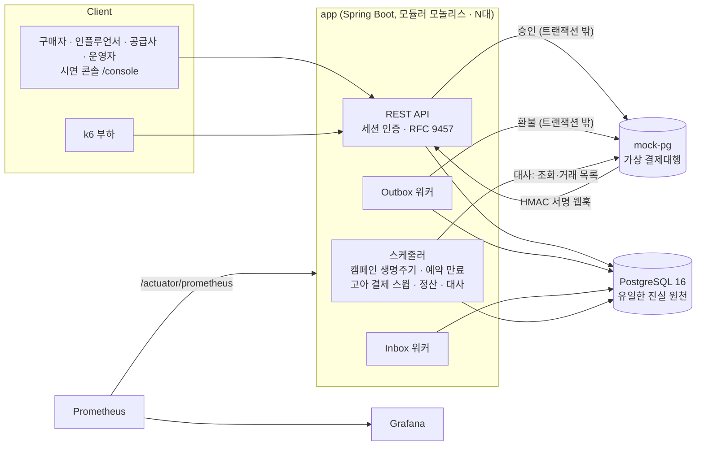
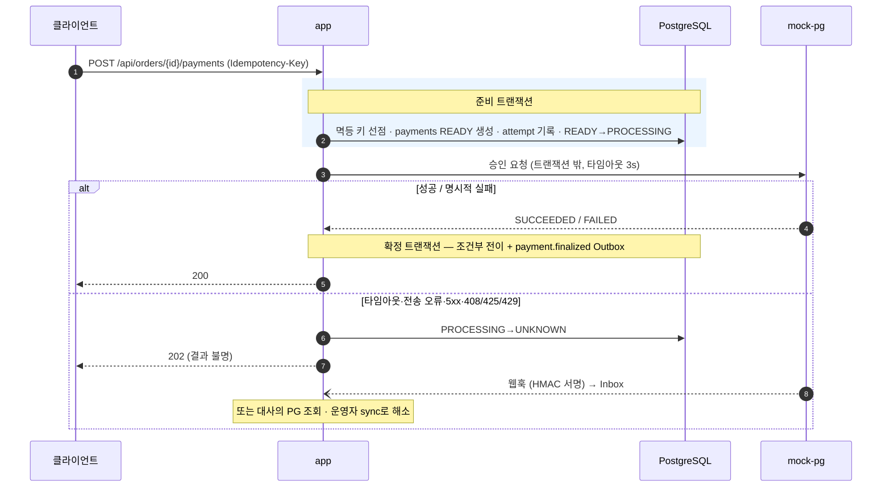
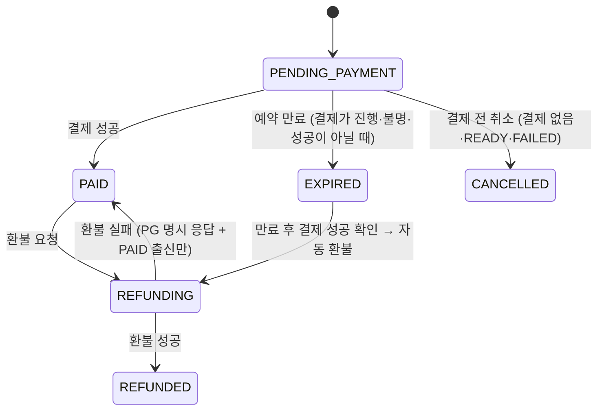
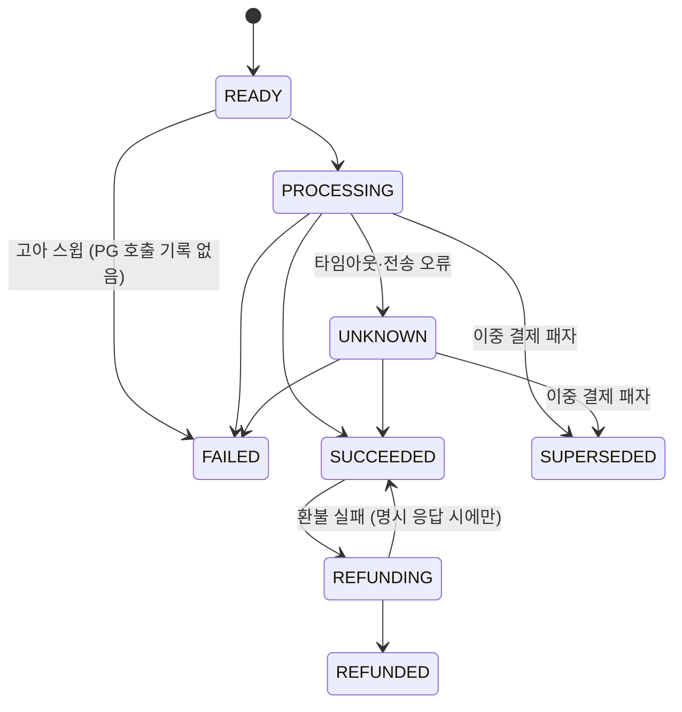

# GroupDrop (CrewDeal)

> 인플루언서가 여는 **한정 시간·한정 수량 공동구매** 백엔드.
> 재고 100개에 주문 1,000건이 한꺼번에 몰려도 초과 판매하지 않고, 결제 응답이 유실되어도
> 멱등 처리·웹훅·대사로 최종 상태를 복구하며, 환불이 섞여도 정산 금액이 원 단위까지 맞는다.

신입 백엔드 포트폴리오로 1인이 6주 동안 만들었다. 쇼핑몰 CRUD가 아니라 **동시성·외부 결제 불확실성·금액 정합성**
세 가지 문제를 푸는 데 집중했고, 모든 주장은 자동 테스트와 부하·장애 주입 실행 로그로 뒷받침한다.

`Java 21` · `Spring Boot 4.0.7` · `PostgreSQL 16` · `Flyway` · `DB Outbox/Inbox` · `Testcontainers` · `k6` · `Docker Compose` · `Prometheus/Grafana`

---

## 목차

1. [풀려는 문제와 결과](#1-풀려는-문제와-결과)
2. [검증 결과](#2-검증-결과)
3. [시스템 구성](#3-시스템-구성)
4. [핵심 설계](#4-핵심-설계)
5. [상태 모델](#5-상태-모델)
6. [빠른 시작](#6-빠른-시작)
7. [테스트와 릴리스 게이트](#7-테스트와-릴리스-게이트)
8. [API 개요](#8-api-개요)
9. [프로젝트 구조](#9-프로젝트-구조)
10. [도입하지 않은 기술](#10-도입하지-않은-기술)
11. [범위와 한계](#11-범위와-한계)

---

## 1. 풀려는 문제와 결과

| 문제 | 해법 | 결과 (근거) |
|---|---|---|
| **초과 판매** — 판매 시작 직후 한 SKU에 주문이 집중된다 | 조건부 원자 `UPDATE`로 재고를 예약한다. 재고 행을 미리 읽거나 잠그지 않고, Redis도 없이 DB 한 문장으로 판정한다 | 재고 100 / 주문 1,000건 → 성공 **정확히 100**, 품절 900, 5xx 0%, 불변식 위반 0. 앱 2대에서도 동일 ([S1-a](docs/05-검증-보고서/증거/2026-09-26-s1-a.txt), [S1-b](docs/05-검증-보고서/증거/2026-09-26-s1-b.txt)) |
| **외부 결제의 불확실성** — 타임아웃·응답 유실·중복/역순 웹훅 | PG 호출을 트랜잭션 밖으로 분리하고, 타임아웃은 실패가 아니라 `UNKNOWN`으로 둔다. 멱등 키·Inbox 유니크·허용 전이표로 중복을 흡수하고 웹훅·조회·대사로 해소한다 | 앱을 `docker kill`로 죽인 뒤에도 `UNKNOWN` 결제 20건이 전부 `SUCCEEDED`/`PAID`로 복구, 불변식 위반 0 ([복구 로그](docs/05-검증-보고서/증거/2026-09-26-compose-kill-recovery.txt)) |
| **환불이 섞인 금액 정합성** — 공급사·인플루언서·플랫폼 3자 정산 | DB 트리거로 강제하는 불변 복식 원장, 반대 분개 보정, bp 정수 절사 + 잔여 라운딩, 수령 주체별 정산 항목 유니크, PG 대사 | 결제·환불이 섞여도 모든 원장 거래에서 차변 = 대변, 정산 재실행에도 이중 포함 0, 정산 후 환불은 회수 배치로 자동 상계 (S5·S6·S8) |

---

## 2. 검증 결과

검증 시나리오 S1~S8은 기획 단계에서 성공 조건과 함께 먼저 정의했고, `load-test/scripts/release-gate.sh` 한 번으로
전부 다시 실행된다. 게이트는 각 단계의 전체 출력을 [`docs/05-검증-보고서/증거/`](docs/05-검증-보고서/증거/)에
`YYYY-MM-DD-<단계>.txt`로 남긴다.

**최신 게이트 실행: 2026-09-26, 커밋 `54b3dd4`** — 전 단계 PASS

| # | 증명하는 것 | 방법 | 최신 결과 |
|---|---|---|---|
| **S1-a** | 재고 동시성 (단일 인스턴스) | k6 200 VU × 5회 = 1,000건, 재고 100, 1인 구매 제한 10 → 불변식 SQL | 성공 100 / 품절 900 / 5xx 0 / 재고 `available·reserved·sold = 0·100·0` / 위반 0 — `iteration_duration` p50·p95·p99 = 236.71ms · 809.55ms · 1.13s |
| **S1-b** | 재고 동시성 (앱 2대) | 같은 조건을 인스턴스당 500건씩 분산 | app1·app2 각 500건, 성공 100 / 품절 900 / 5xx 0 / 위반 0 — p50·p95·p99 = 331.13ms · 1.09s · 1.42s |
| **S2** | 결제 멱등 | 같은 `Idempotency-Key`로 동시 결제 요청 | 결제 1건, PG 호출 1회 (`PaymentConcurrencyTest`) |
| **S3** | 웹훅 멱등 | 같은 이벤트 ID 웹훅 반복·역순 전송 | Inbox 1건, 주문 전이 1회, 원장 거래 1건 (`PaymentWebhookApiTest`) |
| **S4-a** | `UNKNOWN` → 웹훅 복구 | PG를 "성공 후 타임아웃" 모드로 두고 결제 → 이후 웹훅 수신 (실증에서는 mock-pg가 보류한 웹훅을 재발사) | `SUCCEEDED`·`PAID` 전이 (`PaymentFailureRecoveryTest` + `docker kill` 실증) |
| **S4-b** | `UNKNOWN` → 대사 복구 | 웹훅 없이 대사만 실행 | 대사 직후 `SUCCEEDED`, 다음 폴링에서 `PAID` (`ReconciliationIntegrationTest`) |
| **S5** | 원장 균형 | 결제·환불 혼합 데이터 재검산 | 모든 거래 차변 = 대변, 불균형 거래 0건 (`LedgerIntegrationTest`), 정산 E2E에서 `ledger_unbalanced_total 0` |
| **S6** | 정산 중복 방지 | 정산 완료 후 재실행 | 주문 항목이 수령 주체별 정상 정산 항목에 1번만 포함 (`SettlementFlowIntegrationTest`) |
| **S7** | PG 불일치 대사 | 불일치 거래 주입 (자동 테스트는 스텁 PG, E2E는 mock-pg) | 8개 유형 분류, 발생 시각 1초 허용 경계(1,001ms는 OPEN) (`ReconciliationIntegrationTest`), 미해결 불일치가 있으면 정산 `HELD` (`SettlementFlowIntegrationTest`) |
| **S8** | 정산 후 환불 회수 | 지급 완료 배치에 속한 주문 환불 | 회수(음수) 배치 자동 생성·실행, 지급 예정금 잔액 0 (`SettlementRecoveryIntegrationTest`) |

같은 게이트는 이 밖에 mock-pg 전체 테스트, 실제 HTTP로 도는
[환불 E2E](docs/05-검증-보고서/증거/2026-09-26-refund-e2e.txt)·[정산·대사 E2E](docs/05-검증-보고서/증거/2026-09-26-settlement-e2e.txt),
[`docker kill` 복구](docs/05-검증-보고서/증거/2026-09-26-compose-kill-recovery.txt)까지 실행한다.

`docker kill` 복구 실증은 격리된 Compose 스택에서 앱 2대를 띄우고, PG가 성공 후 응답을 버리게 만든 뒤 `app`을
강제 종료했다가 재기동하고 보류된 웹훅을 다시 보낸다. 결과: `UNKNOWN` 20건 → 결제 `SUCCEEDED` 20 / 주문 `PAID` 20,
Outbox·Inbox 모두 `app` 9건 + `app2` 11건 = 20건 `PROCESSED` (두 인스턴스가 중복 없이 나눠 처리),
`payment-recovery-invariants.sql` 위반 0.

> **수치 읽는 법.** S1의 판정 기준은 "성공 정확히 100·5xx 1% 미만·불변식 위반 0"이고, 이 판정은 증거가 남은
> 게이트 실행 9회(2026-09-03 ~ 09-26, 같은 날 재실행 포함)에서 모두 같았다. 지연은 로컬 Docker 단일 호스트에서 잰
> k6 수치라 참고치로만 본다. 기획서는 주문 생성 API p95 500ms를 **잠정 목표**로 두는데, 2026-09-06 실행은 이를 만족했고
> (`iteration_duration` p95: S1-a 455.80ms, S1-b 592.80ms — [부하 테스트 보고서](docs/05-검증-보고서/01-부하-테스트.md))
> 최신 2026-09-26 실행은 넘었다 (S1-a `http_req_duration` p95 773.37ms).

검증 보고서 모음: [보고서 안내](docs/05-검증-보고서/00-보고서-안내.md) ·
[부하 테스트](docs/05-검증-보고서/01-부하-테스트.md) · [장애 주입](docs/05-검증-보고서/02-장애-주입.md) ·
[최종 회귀](docs/05-검증-보고서/03-최종-회귀.md) · [동시성 경쟁 재현과 해결](docs/05-검증-보고서/04-동시성-재현과-해결.md) ·
[결제 장애 복구](docs/05-검증-보고서/05-결제-장애-복구.md) · [콘솔 시연](docs/05-검증-보고서/06-콘솔-시연.md)

---

## 3. 시스템 구성



- **단일 배포 단위, 다중 인스턴스 안전.** 모든 워커와 스케줄러는 in-process `@Scheduled`다. 분산 락 없이
  조건부 `UPDATE`·`FOR UPDATE SKIP LOCKED`·부분 유니크 인덱스만으로 두 대 이상에서 동시에 돌아도 안전하다 (S1-b, `docker kill` 실증).
- **mock-pg**는 별도 Spring Boot 앱이다. 승인·환불·조회·대사용 거래 목록 API와, 장애 모드(`DECLINE`·`DELAY`·
  `SUCCEED_BUT_TIMEOUT` 등)·웹훅 재발사·불일치 거래 주입 같은 테스트 제어 API를 제공한다. `merchantPaymentId` 기준으로 멱등이다.
- **도메인 패키지** (`app/src/main/java/com/groupdrop/`):

| 패키지 | 책임 |
|---|---|
| `user` | 세션 로그인, 4개 역할(BUYER·INFLUENCER·SUPPLIER·ADMIN), 시드 계정 |
| `product` | 공급사 상품·SKU 등록 |
| `campaign` | 캠페인 생명주기(승인·자동 시작/종료·품절 표시·강제 종료), 정책 버전 |
| `order` | 주문, 재고 예약·만료, 구매 제한, 결제 전 취소 |
| `payment` | 결제 승인, 멱등성, `UNKNOWN` 처리, 웹훅 수신·서명 검증, 고아 결제 스윕 |
| `outbox` | Transactional Outbox / Inbox 인프라 (도메인 비의존) |
| `refund` | 전체 환불 접수·실행 워커, 이중 결제 보상 환불 |
| `ledger` | 불변 복식 원장, 균형 검증, 예상 정산액 |
| `settlement` | 정산 배치·지급, 정산 후 환불 회수 배치 |
| `reconciliation` | PG 대사, 운영자 재처리 |
| `common` | `Clock` 주입, RFC 9457 오류 포맷, 요청 ID, 캠페인 트랜잭션 장벽, 감사 로그 |

---

## 4. 핵심 설계

### 4.1 재고: 조건부 원자 UPDATE

재고를 읽고, 계산하고, 저장하는(count-then-insert) 코드는 없다. 판정과 차감이 한 문장이다
([`OrderRepository.java`](app/src/main/java/com/groupdrop/order/OrderRepository.java)).

```sql
UPDATE campaign_inventories ci
   SET available_quantity = ci.available_quantity - ?,
       reserved_quantity = ci.reserved_quantity + ?
  FROM campaign_skus cs
 WHERE ci.campaign_sku_id = cs.id
   AND cs.campaign_id = ? AND cs.product_sku_id = ?
   AND ci.available_quantity >= ?
RETURNING ci.id AS inventory_id, cs.id AS campaign_sku_id
```

- 영향 행이 0이면 품절(`409 INVENTORY_SOLD_OUT`)이다. 주문에 SKU가 여럿이면 하나라도 실패할 때 트랜잭션 전체를 롤백한다.
- 1인 구매 제한도 같은 방식이다: `UPDATE campaign_user_purchase_counters SET quantity = quantity + ?, … WHERE … AND quantity + ? <= ?`.
- 재고 행은 미리 읽거나 잠그지 않는다. 캠페인 행만 `FOR SHARE`로 잡아 판매 기간·상태를 확인하고, 운영자 강제 종료와 주문이 엇갈리지 않게 한다.
- 재고 불변식 `초기 = 판매 가능 + 예약 + 판매 완료`와 `예약 = ACTIVE 예약 합`을 부하 후 SQL로 검사한다
  ([`inventory-invariants.sql`](load-test/sql/inventory-invariants.sql)).
- 미결제 예약은 10분 뒤 만료되어 재고로 돌아간다. 만료 워커는 `FOR UPDATE SKIP LOCKED`로 후보를 나눠 잡고,
  결제가 `PROCESSING`·`UNKNOWN`·`SUCCEEDED`인 주문은 만료시키지 않는다.

> 비관적 락은 조건이 하나뿐이라 잠글 실익이 없고, 낙관적 락은 인기 SKU에서 재시도가 정상 경로가 되며,
> Redis 재고는 원천을 둘로 만든다. 그래서 선택하지 않았다.

### 4.2 결제: 트랜잭션 밖 PG 호출과 `UNKNOWN`



- **PG 호출 중에는 DB 트랜잭션도 커넥션도 잡지 않는다.** 준비 → 호출 → 확정을 `TransactionTemplate`으로 명시적으로 나눴다
  ([`PaymentService.java`](app/src/main/java/com/groupdrop/payment/PaymentService.java)).
  대신 요청 스레드가 PG 호출 중 죽는 경우에 대비해, 1분 주기 **고아 결제 스윕**이 PG 타임아웃의 2배(6초)를 넘긴 결제 중
  PG 호출 기록이 있는 `PROCESSING`은 `UNKNOWN`으로, 호출 기록이 없는 `READY`는 `FAILED`로 정리한다.
- **타임아웃은 실패가 아니다.** 승인된 결제를 실패로 적으면 재고가 재판매되고 고객 청구는 남는다. 그래서 타임아웃·전송 오류·5xx,
  그리고 PG의 408/425/429 응답은 `UNKNOWN`으로 두고 API는 `202`로 답한다. `UNKNOWN`은 웹훅, 대사(30분 주기)의 PG 조회 단계,
  운영자 `POST /api/admin/payments/{id}/sync` 중 먼저 오는 경로로 해소된다. PG 조회는 같은 `merchantPaymentId`로 승인을
  다시 요청하는 방식이다(PG가 이 ID 기준으로 멱등).
- **결제 확정 경로는 하나다.** 동기 응답·웹훅·조회·스윕 어디서 오든 [`PaymentFinalizer`](app/src/main/java/com/groupdrop/payment/PaymentFinalizer.java)의
  조건부 전이만 통과하고, `payment.finalized` Outbox 이벤트도 여기서만 발행한다.
- **멱등 키.** `(scope, idempotency_key)` 유니크로 선점하고 24시간 유지한다. 같은 키 재요청은 저장된 응답을 재생하고, 본문이 다르면
  `409 IDEMPOTENCY_KEY_REUSED`, 처리 중이면 `409 IDEMPOTENCY_REQUEST_IN_PROGRESS`, 만료되었으면 `409 IDEMPOTENCY_KEY_EXPIRED`로 답한다. 요청 스레드가 죽어 `IN_PROGRESS`로 남은 선점은
  레코드를 지우지 않고 결제의 현재 상태로 **완료 처리**한다. 지우면 같은 키가 새 요청이 되어 두 번째 PG 승인이 열리기 때문이다.
- **한 주문에 유효 결제는 하나.** 진행 중 결제가 있으면 애플리케이션이 `409 PAYMENT_ALREADY_IN_PROGRESS`로 먼저 막지만, 이는 예방일 뿐이고
  최종 강제는 부분 유니크 인덱스다. 경쟁을 뚫고 성공한 두 번째 결제는 `SUPERSEDED`로 보내고 자동 보상 환불한다.

  ```sql
  CREATE UNIQUE INDEX ux_payments_order_effective
      ON payments (order_id)
      WHERE status IN ('SUCCEEDED', 'REFUNDING', 'REFUNDED');
  ```

### 4.3 웹훅과 Outbox / Inbox

- 웹훅 서명은 `X-PG-Signature` = `HMAC-SHA256(secret, timestamp + "." + 원본 본문)`, 타임스탬프는 `X-PG-Timestamp`로 받는다.
  역직렬화 전 원문으로 검증하고, 서명이 틀리면 `401 WEBHOOK_SIGNATURE_INVALID`, 타임스탬프가 5분 이상 어긋나면 거부한다.
  검증을 통과하면 Inbox에 적재만 하고 즉시 200을 돌려준다(처리는 비동기, 중복이면 `"result": "DUPLICATE"`).
- 중복 방어는 두 겹이다. ① `inbox_events.provider_event_id` 유니크 + `ON CONFLICT DO NOTHING`,
  ② 모든 효과가 조건부 전이라서 재처리해도 한 번만 반영된다. 순서 역전은 `occurredAt` 비교가 아니라 **허용 전이표**로 판정하며,
  허용되지 않는 전이는 실패가 아니라 `IGNORED`로 종결하고 감사 로그를 남긴다.
- Outbox·Inbox 워커는 `FOR UPDATE SKIP LOCKED`로 이벤트를 나눠 잡고 `available_at`을 미뤄 리스를 건다.
  실패하면 5초 간격으로 최대 10회 재시도한 뒤 `FAILED`로 멈추고, 운영자 재처리 API로만 되살린다.
- Kafka를 쓰지 않은 이유: Kafka를 써도 DB 커밋과 발행의 원자성을 위해 결국 Outbox가 필요하고, 이벤트가 3종
  (`payment.finalized`, `refund.requested`, `refund.completed`)뿐이다.

### 4.4 환불

요청 스레드는 `refunds` 행과 `refund.requested` Outbox 이벤트를 한 트랜잭션에 커밋하고 `202`로 답한다. PG 환불 호출은
Outbox 워커가 트랜잭션 밖에서 한다. 성공 결제당 유효 환불은 1건이며 `refunds(payment_id) WHERE status <> 'FAILED'` 부분 유니크가
최종 방어선이다. PG 환불 응답이 유실되면 `REQUESTED`에 머물고, Outbox 재시도와 대사의 미완 환불 해소 단계로 확정한다.
MVP는 **운영자가 실행하는 전액 환불**만 지원하며, 캠페인 종료 후 30일이 지나면 `409 REFUND_WINDOW_CLOSED`로 거부한다.

### 4.5 원장: 불변 복식부기

- **불변성은 규율이 아니라 DB가 강제한다.** `ledger_transactions`·`ledger_entries`에 대한 UPDATE/DELETE는 트리거가 거부한다
  ([`V4__refunds_and_ledger.sql`](app/src/main/resources/db/migration/V4__refunds_and_ledger.sql)).

  ```sql
  CREATE TRIGGER trg_ledger_entries_immutable
      BEFORE UPDATE OR DELETE ON ledger_entries
      FOR EACH ROW EXECUTE FUNCTION ledger_reject_mutation();
  -- 거부 메시지: '원장은 불변입니다 (LED-01). 보정은 반대 거래를 추가하세요: <테이블명>'
  ```

- **환불은 반대 분개다.** 금액을 다시 계산하지 않고 원본 결제 분개의 차변·대변만 뒤집는다. 재계산하면 정책이 바뀌었을 때
  결제와 환불이 어긋나 잔액이 영구히 남는다.
- **원장 거래 멱등.** `(transaction_type, reference_type, reference_id)` 유니크라서 이벤트가 재전달되어도 분개는 한 번이다.
- **라운딩은 bp 정수 연산 + 잔여.** 커미션과 PG 수수료는 원 단위 절사, 플랫폼 수익은 나머지다. 그래서 차변 = 대변이 구조적으로 성립한다.
  `double`·`BigDecimal`을 쓰지 않는다. 19,900원 · 커미션 7.5% · PG 수수료 3% · 공급 단가 1,000원일 때:

  | 계정 | 금액 | 계산 |
  |---|---:|---|
  | 차변 PG 미수금 | 19,900 | 결제 금액 |
  | 대변 공급사 지급 예정금 | 1,000 | 공급 단가 × 수량 |
  | 대변 인플루언서 지급 예정금 | 1,492 | `floor(19,900 × 750 / 10,000)` — 1,492.5에서 절사 |
  | 대변 PG 수수료 예정금 | 597 | `floor(19,900 × 300 / 10,000)` |
  | 대변 플랫폼 수익 | 16,811 | 잔여 |

  테스트 픽스처는 일부러 19,900 × 7.5%처럼 나누어떨어지지 않는 값을 쓴다. 딱 떨어지는 값만 쓰면 라운딩 결함이 영원히 통과한다.
- **정산 금액의 원천은 원장 하나다.** 예상 정산액·정산 배치 모두 "주문별 원장 금액의 합"을 읽는다. 별도 집계식은 검증용 불변식일 뿐이다.
- 주문은 캠페인의 현재 정책이 아니라 **정책 버전**을 FK로 참조하고 분개도 그 버전에서 읽는다. MVP에는 판매 시작 후 정책을 바꾸는
  경로가 없어 버전은 1개뿐이지만, 변경 경로가 생겨도 이미 받은 주문의 분개가 소급 변경되지 않게 하는 방어적 설계다.

### 4.6 정산과 대사

- **정산 흐름.** 캠페인이 `CLOSED`된 뒤 유예 기간(기본 7일)이 지나고, 그 캠페인의 미처리 확정 이벤트와 미확정 결제가 0건이면
  `SETTLING`으로 동결한다. 수령 주체(공급사·인플루언서)별 배치를 만들어 검증 → 가상 지급하고, 모든 배치가 `COMPLETED`면
  캠페인은 `SETTLED`가 된다. 전액 환불되어 정산할 것이 없는 캠페인은 배치 없이 바로 `SETTLED`로 끝난다.
- **이중 정산 방지 (S6).** `settlement_items`에 `UNIQUE (payee_type, order_item_id)`와 복합 FK `(batch_id, payee_type)`를 둬서,
  한 주문 항목이 공급사 배치와 인플루언서 배치에 각각 정확히 한 번씩만 들어간다.
- **동결 스냅숏 경쟁 방지.** 결제 준비·결제 확정·환불 확정·정산 동결이 모두 먼저 캠페인 행을 `SELECT … FOR UPDATE`로 잠근다
  ([`CampaignTransactionBarrier`](app/src/main/java/com/groupdrop/common/CampaignTransactionBarrier.java)).
  READ COMMITTED에서 "미확정 결제 0건"과 "주문 목록"을 따로 읽는 사이에 결제가 확정되어 정산에서 빠지는 경쟁을 막는다.
  PG 호출 중에는 이 잠금을 잡지 않는다.
- **정산 후 환불 (S8).** 정산 배치에 포함된(정산 항목이 있는) 주문이 환불되면, 배치의 지급 여부와 무관하게 음수 금액의 `RECOVERY` 배치를 즉시 만들어 상계한다.
  `settlement_adjustments (settlement_item_id, refund_id)` 유니크로 재전달에도 한 번만 생긴다.
- **대사 (S4-b·S7).** 3단계로 돈다: ① 비최종 결제를 PG 조회로 해소 → ② PG 거래와 내부 결제를 매칭해 불일치 분류 → ③ 원장 전수 재검산.
  불일치는 8개 유형이다: `MISSING_INTERNAL`, `MISSING_PROVIDER`, `AMOUNT_MISMATCH`, `STATUS_MISMATCH`, `REFUND_MISMATCH`,
  `OCCURRED_AT_MISMATCH`(발생 시각 1초 초과 차이), `DUPLICATE_PAYMENT`, `UNRESOLVED_INTERNAL`.
  미해결 불일치가 있는 캠페인의 정산은 `HELD`로 보류한다.
- **대사는 한 번에 하나만.** `reconciliation_runs ((1)) WHERE status = 'RUNNING'` 부분 유니크로 실행 세대를 직렬화한다. 멈춘 실행은
  stale 판정 후 `FAILED`로 회수하고, 자동 해소는 이번 실행의 cutoff 이전에 발생한 불일치에만 적용한다.

### 4.7 공통 규칙

- **상태 전이는 허용 전이표 + 조건부 `UPDATE … WHERE status = :expected`로만 한다.** 영향 행 0이면 원인을 구분해 응답한다.
- **상태 값의 진실 원천은 DB `CHECK` 제약이다.** 주문·결제 상태는 Java enum이 아니라 문자열이고, 허용 값은 Flyway 마이그레이션에 있다.
- **시간은 주입한 `Clock`으로만 읽는다.** `Instant.now()`·`LocalDateTime.now()` 직접 호출은 금지이고, 유예 기간·예약 시간·폴링 주기는
  모두 프로퍼티로 뺐다 ([`application.yml`](app/src/main/resources/application.yml)).
- **도메인·검증·인증 오류는 RFC 9457 `ProblemDetail`** 에 도메인 오류 `code`를 더한 형식이다. 모든 요청에 `X-Request-Id`를 받거나
  생성해 응답 헤더로 돌려주고 MDC(`requestId`)에 넣는다 (기본 로그 패턴에는 출력되지 않는다).
- **커밋된 Flyway 마이그레이션은 수정하지 않는다.** 스키마 변경은 새 버전 파일로만 한다 (현재 V1~V8).

---

## 5. 상태 모델

모든 상태는 DB `CHECK` 제약으로 허용 값이 고정되어 있다. 표에 없는 전이는 거부된다.

**주문** (`V2__orders_and_stock_reservations.sql`)



**결제** (`V3__payments_outbox_inbox.sql`)



만료 출신 주문(`EXPIRED → REFUNDING`)의 환불이 실패하면 `PAID`로 돌아가지 않고 `REFUNDING`에 머물며 운영자 보류(`ops_hold`)가 걸린다.

**캠페인**: `DRAFT → REVIEWING → SCHEDULED → OPEN ⇄ SOLD_OUT`, `OPEN/SOLD_OUT → CLOSED`(종료 시각 도달 또는 운영자 강제 종료),
`CLOSED → SETTLING → SETTLED`. 반려 시 `REVIEWING → DRAFT`, 운영자 `/cancel`은 `SCHEDULED`면 `CANCELLED`, `OPEN`·`SOLD_OUT`이면 `CLOSED`로 보낸다.
`SOLD_OUT`은 표시일 뿐 주문 게이트가 아니다.

**정산 배치**: `PENDING → READY → PROCESSING → COMPLETED`. `PENDING/READY/FAILED → HELD`, `HELD → PENDING`, `PROCESSING → FAILED`
(지급 실패, 또는 5분 넘게 멈춘 지급). 재시도는 `FAILED → PENDING`으로 되돌려 지급 전 검증을 다시 통과시킨 뒤 `READY → PROCESSING`으로 간다.

**재고 예약**: `ACTIVE → CONFIRMED | RELEASED | EXPIRED` · **환불**: `REQUESTED → COMPLETED | FAILED`

---

## 6. 빠른 시작

**필요한 것**: Docker (Compose v2). 시드·게이트 스크립트에는 bash·curl·jq, 로컬에서 Gradle로 테스트를 돌리려면 JDK 21.

### 전체 스택

```bash
docker compose up -d --build
```

| 서비스 | 주소 | 비고 |
|---|---|---|
| app | http://localhost:8080 | `/actuator/health`, `/actuator/prometheus` |
| 시연 콘솔 | http://localhost:8080/console/index.html | 4개 역할 화면 + 장애 주입 패널(`/console/demo/`). 운영 API 점검용 단일 화면은 `/admin/index.html` |
| Swagger UI | http://localhost:8080/swagger-ui/index.html | OpenAPI 문서 |
| mock-pg | http://localhost:8081 | 가상 결제대행 |
| PostgreSQL | localhost:5432 | DB·계정 `groupdrop` |
| Prometheus | http://localhost:9090 | 5초 간격 수집 |
| Grafana | http://localhost:3000 | `admin` / `admin`, GroupDrop 대시보드 자동 프로비저닝 |

포트는 `APP_PORT`, `MOCK_PG_PORT`, `POSTGRES_PORT`, `PROMETHEUS_PORT`, `GRAFANA_PORT`(앱 2대 구성에서는 `APP2_PORT`) 환경변수로 바꿀 수 있다.

### 시연 스택 (콘솔로 전 과정 보기)

정산 유예 기간을 0초로 줄인 오버레이와 시드 스크립트로, 캠페인 개설부터 결제·환불·정산·대사까지 브라우저에서 따라갈 수 있다.

```bash
# 항상 볼륨까지 지우고 시작한다 — mock-pg는 인메모리라서 DB 볼륨과 어긋나면 새 결제가 막힌다
docker compose -f docker-compose.yml -f docker-compose.demo.yml down -v
docker compose -f docker-compose.yml -f docker-compose.demo.yml up -d --build
./ops/demo/seed-demo.sh   # 시연 직전에 실행 (생성된 미결제 주문은 10분 뒤 만료)
```

시드 계정 (비밀번호 공통 `groupdrop123!`):

| 역할 | 이메일 |
|---|---|
| 운영자 | `admin@groupdrop.test` |
| 인플루언서 | `influencer@groupdrop.test` |
| 공급사 | `supplier@groupdrop.test` |
| 구매자 | `buyer1@groupdrop.test`, `buyer2@groupdrop.test` |

같은 브라우저에서 두 역할을 동시에 쓰려면 세션 쿠키가 섞이지 않게 한쪽은 `localhost`, 다른 쪽은 `127.0.0.1`로 연다.
시나리오별 조작 순서와 실측 시간은 [콘솔 시연 보고서](docs/05-검증-보고서/06-콘솔-시연.md)에 있다.

> ⚠️ **로컬 시연 전용.** 시드 비밀번호가 고정되어 있고 mock-pg 테스트 제어 API는 인증이 없다. 외부에 노출하지 않는다.

### 앱 2대로 띄우기

```bash
docker compose -f docker-compose.yml -f docker-compose.two-instances.yml up -d --build
```

`app2`가 58083 포트로 추가된다. Outbox·Inbox 폴링 주기(1초)와 배치 크기(3)를 줄여 두 인스턴스가 이벤트를 나눠 처리하는 모습을
보기 쉽게 하고, 예약 유지 시간은 30분·고아 결제 스윕은 30초로 바꾼다. Prometheus·Grafana는 `observability` 프로필로 빠져 기동하지 않는다.

---

## 7. 테스트와 릴리스 게이트

### 자동 테스트

```bash
(cd app && ./gradlew cleanTest test)       # Testcontainers PostgreSQL — Docker 실행 필요
(cd mock-pg && ./gradlew cleanTest test)
```

- H2 없이 **실제 PostgreSQL**(Testcontainers)로 제약·트리거·잠금을 그대로 검증한다.
- 테스트 메서드는 app `@Test` 184개 + `@RepeatedTest(5)` 3개, mock-pg `@Test` 38개다(소스 기준 집계).
  2026-09-06 최종 회귀 보고서 시점에는 app 164 / mock-pg 24 tests, 실패·오류·스킵 0이었다.
- 동시성은 두 계층으로 검증한다. ① 단일 JVM 스레드 동시성: `ExecutorService` + `CountDownLatch`/`CyclicBarrier` + Testcontainers로
  멱등 키 동시 요청·결제와 만료의 경쟁·구매 제한을 매 실행 검사한다. ② 다중 인스턴스: 앱 2대 + 공유 DB + k6 부하 후 불변식 SQL로
  재고 초과 판매·Outbox 중복 소비를 검사한다. 단일 JVM 테스트는 커넥션 풀·인메모리 상태를 공유하므로 다중 인스턴스 안전성을
  증명하지 못한다 — 그래서 ②를 따로 돌린다.
- 대표 테스트: `PaymentConcurrencyTest`(S2), `PaymentWebhookApiTest`(S3), `PaymentFailureRecoveryTest`(S4-a),
  `ReconciliationIntegrationTest`(S4-b·S7), `LedgerIntegrationTest`(S5·원장 불변 트리거), `SettlementFlowIntegrationTest`(S6·동결 경쟁),
  `SettlementRecoveryIntegrationTest`(S8).

### 릴리스 게이트

```bash
cd load-test && ./scripts/release-gate.sh
```

S1-a → S1-b → S2 … S8 → mock-pg 테스트 → 환불 E2E → 정산·대사 E2E → `docker kill` 복구 순으로 실행하고, 하나라도 실패하면 즉시 멈춘다.

- 추적 중인 소스에 커밋되지 않은 변경이 있으면 실행을 거부한다(증거 디렉터리와 미추적 파일은 판정에서 제외). `ALLOW_DIRTY=1`로
  우회하면 증거 파일의 `source_commit`에 `-dirty`가 붙는다.
- 단계마다 격리된 Compose 프로젝트와 전용 포트를 쓰므로 로컬 개발 스택과 충돌하지 않는다.
- 각 단계의 전체 출력이 `docs/05-검증-보고서/증거/<날짜>-<단계>.txt`에 기록된다.
- k6 시나리오는 [`load-test/k6/`](load-test/k6/), 판정 SQL은 [`load-test/sql/`](load-test/sql/)에 있다.

---

## 8. API 개요

REST 엔드포인트 56개. 전체 명세는 실행 후 Swagger UI(`/swagger-ui/index.html`)에서 본다.
주문 생성·결제 요청·환불 요청은 `Idempotency-Key` 헤더가 필수다(결제 전 주문 취소는 상태 조건으로 멱등하다).

| 영역 | 대표 엔드포인트 |
|---|---|
| 인증 | `POST /api/auth/login` · `POST /api/auth/logout` · `GET /api/auth/me` |
| 상품 (공급사) | `POST /api/suppliers/me/products` · `GET /api/products` |
| 캠페인 | `POST /api/campaigns` · `POST /api/campaigns/{id}/submit` · `POST /api/admin/campaigns/{id}/approve·reject·cancel` · `GET /api/campaigns/slug/{slug}` |
| 주문 | `POST /api/campaigns/{campaignId}/orders` (`201`) · `POST /api/orders/{orderId}/cancel` · `GET /api/orders` |
| 결제 | `POST /api/orders/{orderId}/payments` (`200` 확정 / `202` 결과 불명 / `409` 이중 결제 패자) · `POST /api/webhooks/payments` |
| 환불 (운영자) | `POST /api/payments/{paymentId}/refunds` (`202` 접수) |
| 원장·예상 정산 | `GET /api/admin/orders/{orderId}/ledger` · `GET /api/admin/ledger/unbalanced` · `GET /api/influencers/me/campaigns/{id}/dashboard` · `GET /api/suppliers/me/campaigns/{id}/expected-settlement` |
| 정산 (운영자) | `POST /api/admin/settlements` · `POST /api/admin/settlements/{batchId}/retry·hold·release` · `GET /api/influencers/me/settlements` · `GET /api/suppliers/me/settlements` |
| 대사·운영 | `POST /api/admin/reconciliations` · `GET /api/admin/reconciliation-discrepancies` · `POST /api/admin/payments/{paymentId}/sync` · `POST /api/admin/outbox-events/{id}/retry` · `GET /api/admin/ops/summary` |

도메인·검증·인증 오류는 RFC 9457 형식이다. 예: 품절

```json
{
  "type": "about:blank",
  "title": "Conflict",
  "status": 409,
  "detail": "요청한 SKU의 재고가 부족합니다.",
  "instance": "/api/campaigns/1/orders",
  "code": "INVENTORY_SOLD_OUT"
}
```

---

## 9. 프로젝트 구조

```
.
├── app/                     메인 백엔드 (Spring Boot, 모듈러 모놀리스)
│   └── src/main/
│       ├── java/com/groupdrop/   도메인 패키지 11개 (3장 표 참고)
│       └── resources/
│           ├── db/migration/     Flyway V1~V8
│           └── static/console/   역할별 시연 콘솔 (정적 HTML/JS)
├── mock-pg/                 가상 결제대행 (장애 모드·웹훅 서명·대사 거래 목록)
├── load-test/
│   ├── k6/                  S1-a·S1-b 부하 스크립트
│   ├── sql/                 불변식 판정 SQL
│   └── scripts/             release-gate.sh 및 단계별 실행 스크립트
├── ops/
│   ├── prometheus/          수집 설정
│   ├── grafana/             데이터소스·대시보드 프로비저닝
│   └── demo/                seed-demo.sh
├── docs/05-검증-보고서/      검증 보고서와 실행 증거 로그
├── docker-compose.yml                  기본 스택
├── docker-compose.demo.yml             시연 오버레이 (정산 유예 0초)
└── docker-compose.two-instances.yml    앱 2대 오버레이
```

---

## 10. 도입하지 않은 기술

기준은 하나다. **인프라를 하나 늘리면 장애 모드가 하나 늘어난다.** 측정된 병목이 없으면 PostgreSQL 하나로 버틴다.

| 기술 | 대신 쓴 것 | 이유 |
|---|---|---|
| Redis (재고 원천·캐시·분산 락) | 조건부 원자 `UPDATE` | 재고 원천이 둘이 되면 이중 쓰기 정합성 문제가 생긴다. DB가 실제 병목으로 측정되기 전에는 도입하지 않는다 |
| Kafka | DB Outbox / Inbox + 폴링 | Kafka를 써도 원자성을 위해 Outbox가 필요하다. 이벤트는 3종뿐이다 |
| 분산 락 | `FOR UPDATE SKIP LOCKED`, 부분 유니크, 조건부 전이 | 락 서버 장애·만료가 새 장애 모드가 된다 |
| 별도 스케줄러 (Quartz 등) | in-process `@Scheduled` + 조건부 전이 | 여러 대에서 중복 실행되어도 전이가 한 번만 성공하도록 만들었다 |
| 마이크로서비스 | 모듈러 모놀리스 (가상 PG만 분리) | 1인·6주 범위에서 분산 트랜잭션 비용을 질 이유가 없다 |

---

## 11. 범위와 한계

**MVP에서 뺀 것**: 회원가입·소셜 로그인(시드 계정 사용), 실제 PG 연동과 카드 정보 저장, **부분 취소·부분 환불**, 구매자 셀프 환불,
복수 공급사·복수 인플루언서 캠페인, 쿠폰·포인트, 배송·교환·반품, 알림.

**운영 가정**: KRW 단일 통화(정수 원 단위), 캠페인당 공급사 1곳, 예약 유지 10분, PG 수수료 3%(환불 시 반환), 정산 유예 7일,
배송비 없음, 환불해도 재고는 복구하지 않음.

**알려진 한계**
- 정산 "지급"은 내부 가상 처리다. 지급 실패 주입은 실제 외부 장애가 아니라 상태 전이 검증용이다.
- 부하 수치는 로컬 Docker 단일 호스트에서 측정했다. 절대 지연이 아니라 정합성 판정이 목적이다.
- mock-pg는 인메모리다. 재기동하면 거래 기록이 사라지므로 시연 스택은 항상 `down -v`로 시작한다.
